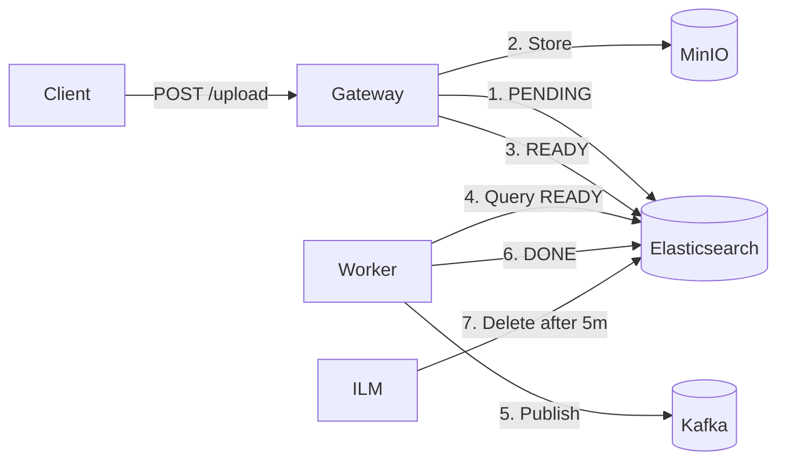

# Stateless File Ingestion Gateway - Technical Report

## System Overview

A stateless file ingestion microservice that receives file uploads, stores them in MinIO, tracks state in Elasticsearch with automatic ILM-based cleanup, and publishes metadata to Kafka.



---

## Architecture

### Components

| Component | Purpose | Port |
|-----------|---------|------|
| **ingestion-gateway** | Spring Boot app handling uploads and background processing | 8080 |
| **elasticsearch** | State storage with ILM for automatic index lifecycle | 9200 |
| **minio** | S3-compatible object storage for files | 9000/9001 |
| **kafka** | Message broker for downstream consumers | 29092 |
| **kibana** | Elasticsearch visualization | 5601 |
| **kafka-ui** | Kafka message visualization | 8090 |

### Key Files

| File | Purpose |
|------|---------|
| `IngestionController.java` | REST endpoint `/api/batches/upload` |
| `IngestionService.java` | Upload processing logic (PENDING → READY) |
| `BatchProcessor.java` | Background worker (READY → DONE + Kafka) |
| `ElasticsearchConfig.java` | ILM policy and index template setup |
| `ESRequest.java` | Elasticsearch document model |

---

## Data Flow

### State Transitions

```
PENDING  →  READY  →  DONE  →  [ILM DELETE]
   │          │         │           │
   │          │         │           └── Index deleted after 5 minutes
   │          │         └── Worker published to Kafka
   │          └── Files uploaded to MinIO
   └── Document created in Elasticsearch
```

### Timing (Production)

| Event | Timing | Description |
|-------|--------|-------------|
| PENDING | Immediate | Document created on upload |
| READY | After upload | Files uploaded to MinIO |
| DONE | Within 5min | Worker cron processes batch |
| DELETE | 7 days | ILM policy deletes index |

---

## ILM (Index Lifecycle Management)

### Policy: `create-replay-policy`

```json
{
  "phases": {
    "hot": { "min_age": "0ms", "actions": {} },
    "delete": { "min_age": "5m", "actions": { "delete": {} } }
  }
}
```

### Index Template: `create-replay-template`

Automatically applies ILM policy to any index matching `create-replay-*`.

### Critical Fix: Startup Race Condition

> **IMPORTANT**: The app may start before Elasticsearch is ready. `ElasticsearchConfig` uses **retry logic with exponential backoff** (10 attempts, 2s→30s delay) to handle this.

```
Attempting to configure Elasticsearch ILM/Template (attempt 1/10)
Failed... Connection refused
...
Attempting to configure Elasticsearch ILM/Template (attempt 5/10)
Elasticsearch ILM policy and template configured successfully. ✅
```

---

## Running the System

### Start
```powershell
docker-compose up -d --build
```

### Demo Script
```powershell
.\demo-states.ps1
```

### Verify
- **Kafka UI**: http://localhost:8090 → Topics → `topic-alpha`, `topic-beta`
- **MinIO**: http://localhost:9001 (minioadmin/minioadmin)
- **Kibana**: http://localhost:5601 → Dev Tools → `GET _cat/indices/create-replay-*`

---

## Lessons Learned

1. **`depends_on` is not enough**: Docker's `depends_on` only waits for container start, not service readiness. Always add retry logic for external dependencies.

2. **ILM templates only apply to new indices**: Existing indices don't automatically get ILM applied. The template must exist BEFORE the index is created.

3. **Idempotent operations**: Elasticsearch's `PUT _ilm/policy` and `PUT _index_template` are idempotent, making repeated deployments safe.

4. **Java Records for nested JSON**: Spring Data Elasticsearch handles Java Records perfectly for nested structures like `FileMetadata` and `UserInputRecord`.
