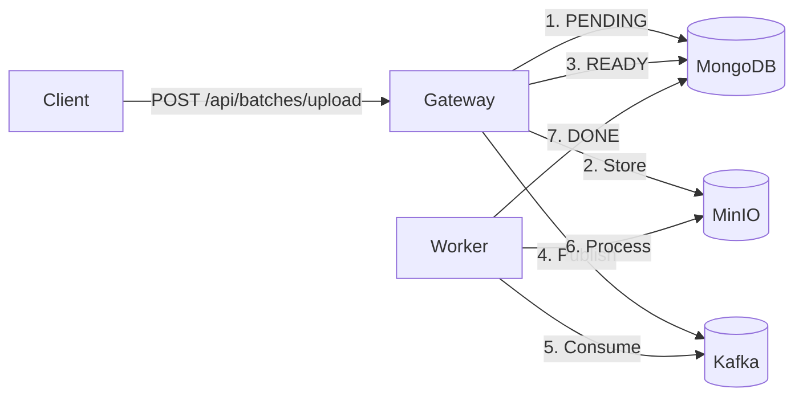

# Stateless File Ingestion Gateway - Technical Report

## System Overview

A stateless file ingestion microservice that receives file uploads, stores them in MinIO, tracks state in Elasticsearch with automatic ILM-based cleanup, and publishes metadata to Kafka.



---

## Architecture

### Components

| Component | Purpose | Port |
|-----------|---------|------|
| **ingestion-gateway** | Spring Boot app handling uploads and background processing | 8080 |
| **mongodb** | Operational database for batch state | 27017 |
| **minio** | S3-compatible object storage for files | 9000/9001 |
| **kafka** | Message broker for downstream consumers | 29092 |
| **mongo-express** | MongoDB admin interface | 8081 |
| **kafka-ui** | Kafka message visualization | 8090 |

### Key Files

| File | Purpose |
|------|---------|
| `IngestionController.java` | REST endpoint `/api/batches/upload` |
| `IngestionService.java` | Upload processing logic (PENDING → READY) with 5s delay |
| `BatchProcessor.java` | Background worker (READY → DONE + Kafka) with 5s delay |
| `BatchDocument.java` | MongoDB document model |
| `MinioService.java` | MinIO interactions |

---

## Data Flow

### State Transitions

```
PENDING  →  READY  →  DONE
   │          │         │
   │          │         └── Worker published to Kafka & Updated Mongo
   │          └── Files uploaded to MinIO
   └── Document created in MongoDB
```

### Timing (Production vs Demo)

| Event | Production Timing | Demo Behavior |
|-------|-------------------|---------------|
| PENDING | Immediate | **5s Delay** (Simulated blocking) |
| READY | After upload | **5s Delay** (Simulated consumer latency) |
| DONE | Asynchronous | Immediate after processing |
| RECOVERY | N/A | Worker runs every **30s**, recovers batches > **5m** old |

---

## Recovery & Deduplication

### Recovery Mechanism
- **Problem**: What if Kafka is down when `IngestionService` tries to publish the "fire-and-forget" event?
- **Solution**: The `BatchProcessor` runs a Scheduled Task every **30 seconds**.
- **Logic**: It queries MongoDB for batches that are in `READY` state for more than **5 minutes**. These are considered "stuck" and the event is re-published to Kafka.

### Deduplication
- **Strategy**: Content-based addressing in `tmp` bucket + UUIDs in `prod` bucket.
- **Tmp**: `tmp-bucket/yy/MM/dd/<sha256-hash>` (Deduplicates identical uploads).
- **Prod**: `prod-bucket/yy/MM/dd/<uuid>/<filename>` (Ensures unique delivery for downstream consumers).

---

## Running the System

### Start
```powershell
docker-compose up -d --build
```

### Demo Script
```powershell
.\demo-refactoring.ps1
```

### Verify
- **Kafka UI**: http://localhost:8090 → Topics → `batch.ingestion.events`
- **MinIO**: http://localhost:9001 (minioadmin/minioadmin)
- **Mongo Express**: http://localhost:8081

---

## Lessons Learned

1. **Kafka Recovery**: Implementing a "pull" based recovery (scheduled task) complements "push" based events for robustness.

2. **Dual Bucket Strategy**: Decoupling ingestion (deduplicated tmp) from delivery (unique prod) saves storage while meeting delivery requirements.

3. **Demo Observability**: Adding artificial delays is crucial for demonstrating transient states (PENDING/READY) that would otherwise process too fast to see.
